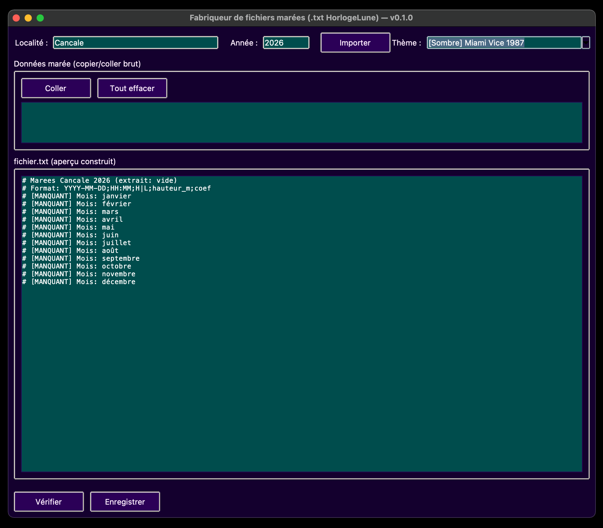

Générateur de fichiers annuels de marées au format compatible **HorlogeLune**.

Marées permet de transformer des données brutes (copiées depuis un site web ou issues du code source HTML) en un fichier texte structuré, vérifié et prêt à être utilisé dans un projet Arduino / HorlogeLune.

## Aperçu

<p align="center">
  
</p>

---

## 🎯 Objectif

Éviter d’éditer manuellement 365 lignes par an.

Le programme :

- Parse les données brutes (texte ou HTML)
- Reconstruit une année complète
- Signale les mois manquants
- Signale les jours manquants
- Vérifie la cohérence temporelle
- Exporte un fichier propre et structuré

---

## 📄 Format du fichier généré

Format strict :


YYYY-MM-DD;HH:MM;H|L;hauteur_m;coef


Exemple :


2026-12-03;01:59;H;10.18;52
2026-12-03;08:51;L;4.35;


Les coefficients ne sont présents que pour les marées hautes (H).

Le fichier contient également :

Marees Cancale 2026 (extrait: 2026-02-01 -> 2026-12-31)
Format: YYYY-MM-DD;HH:MM;H|L;hauteur_m;coef
[MANQUANT] Mois: janvier
[MANQUANT] Jour: 2026-03-14

---

## 🖥️ Interface

- Champ **Localité**
- Champ **Année**
- Zone de collage des données brutes
- Aperçu dynamique du fichier généré
- Boutons :
  - Importer
  - Vérifier
  - Enregistrer
  - Coller
  - Tout effacer
- Sélecteur de thème (thème aléatoire au démarrage)

---

## 🔍 Fonctionnalités de parsing

### Texte brut

Détection automatique :

- Mois (avec ou sans accents)
- Jour
- Marée haute / basse
- Heure
- Hauteur
- Coefficient

Les lignes non pertinentes (lune, saint, lever/coucher) sont ignorées.

---

### HTML (code source d’une page marées)

Le programme peut analyser directement :

- `<div class="high-tide">`
- `<div class="low-tide">`
- `<span class="hour">`
- `<span class="height">`
- `<div class="coef">`

Le mois est détecté via l’ancre :


id="jj-mm"


---

## 🧠 Vérification intelligente

Le bouton **Vérifier** analyse :

- Mois manquants
- Jours manquants
- Marées hautes sans coefficient
- Doublons
- Ordre chronologique invalide
- Trous temporels suspects (> 9h30)
- Trous majeurs (> 18h)

Cela permet de détecter immédiatement une marée oubliée.

---

## 🎨 Thèmes

Bibliothèque interne de thèmes :

- Sombres
- Clairs
- Pouêt-Pouêt

Le thème est choisi aléatoirement au démarrage.
Il peut être changé via la combobox en haut à droite.

---

## 📦 Installation

Aucune dépendance externe.

Requiert Python 3.10+.

Lancement :

```bash
python marees.py
